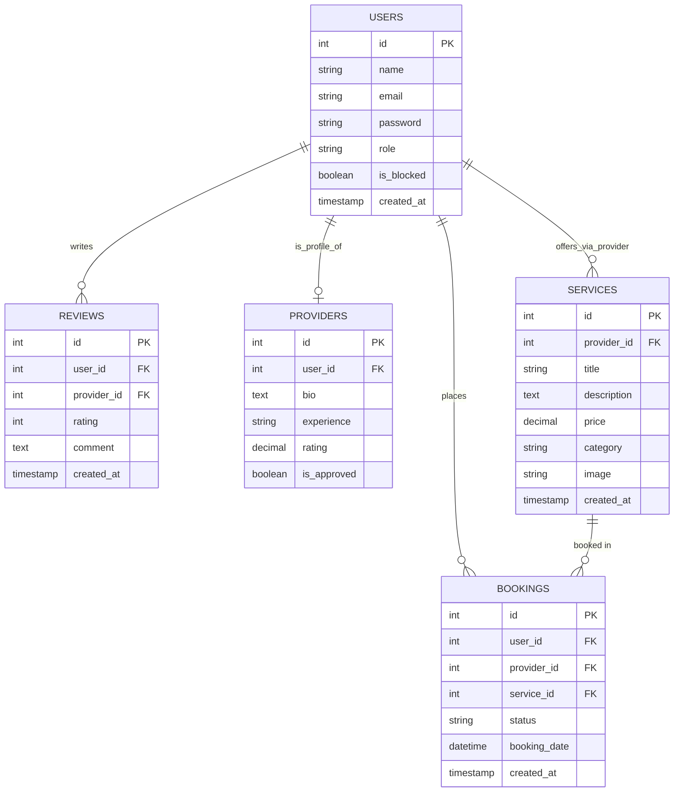

# Service Marketplace ER Diagram

```mermaid
erDiagram
    USERS ||--o{ BOOKINGS : places
    USERS ||--o{ REVIEWS : writes
    USERS ||--o| PROVIDERS : is_profile_of
    USERS ||--o{ SERVICES : offers_via_provider
    SERVICES ||--o{ BOOKINGS : "booked in"

    USERS {
        int id PK
        string name
        string email
        string password
        string role
        boolean is_blocked
        timestamp created_at
    }
    PROVIDERS {
        int id PK
        int user_id FK
        text bio
        string experience
        decimal rating
        boolean is_approved
    }
    SERVICES {
        int id PK
        int provider_id FK
        string title
        text description
        decimal price
        string category
        string image
        timestamp created_at
    }
    BOOKINGS {
        int id PK
        int user_id FK
        int provider_id FK
        int service_id FK
        string status
        datetime booking_date
        timestamp created_at
    }
    REVIEWS {
        int id PK
        int user_id FK
        int provider_id FK
        int rating
        text comment
        timestamp created_at
    }
```
